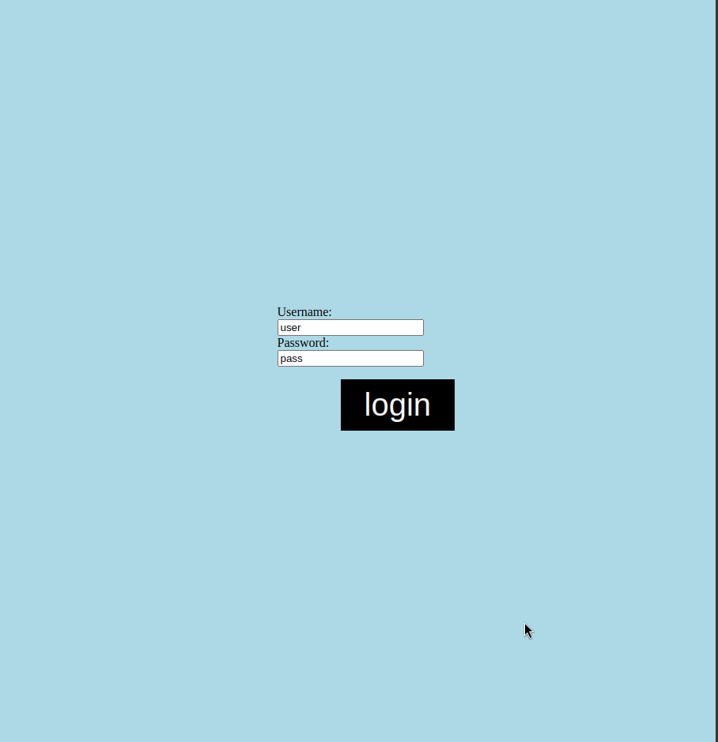
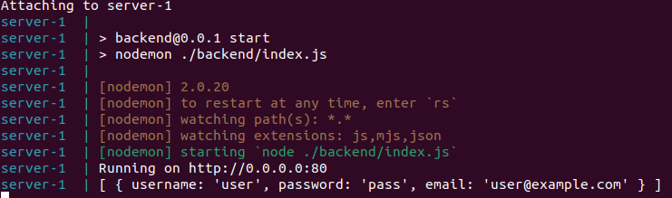

# App Structure

The web app has three main parts. The front-end, back-end/API, and the database.

## Front-End

The front-end is what the user interacts with.
Here we can see that the UI consist of a username and password field.


<br>

If we inspect the page, we can see a source file named _common.js_.
This is a JavaScript file that includes this line of code.

```Javascript
var parsedUrl = new URL(window.location.href);

function query() {
    fetch("http://" + parsedUrl.host + "/query", {
        method: "GET",
        mode: "no-cors",
    })
    .then((resp) => resp.text())
    .then((data) => {
        document.getElementById("response").innerHTML = data;
    })
    .catch((err) => {
        console.log(err);
    })
}
```

`window.location.href` gets the current URL of the page which is `localhost:80` in this case.
The query function sends a request to our server using the `/query` route and displays the data in the HTML element with the "response" id. The full URL in this case would be `localhost:80/query`.

Similar to the `query` function, the `login` function makes http request as well, but the
difference is the login makes a `POST` request instead of a `GET` request.
This fills the http body of our request with the login data, which is a `JSON` object with the field username and password.

```Javascript
function login() {
  let stringifiedbody = JSON.stringify({
    username: document.getElementById("username").value,
    password: document.getElementById("password").value
  })
  console.log(stringifiedbody);
  fetch("http://" + parsedUrl.host + "/login", {
    method: "POST",
    mode: "cors",
    headers: {
      "Content-Type": "application/json"
    },
    body: stringifiedbody
  })
    .then((resp) => {
      if (resp.status = 500) {
        alert("Server Error");
      } else if (resp.status = 401) {
        console.log("Username or password incorrect");
        alert("Username or password incorrect");

      } else if (resp.status = 415) {
        console.log("Incomplete Request");
        alert("Incomplete Request");
      } else {
        location.href = "http://" + parsedUrl.host + "/query.html";
      }
    })
    .catch((err) => {
      console.log(err);
    })
}
```

The HTML of the webpage looks like this

```HTML
<!DOCTYPE html>

<html>
    <link rel="shortcut icon" type="image/x-icon" href="favicon.png">
 <link type="text/css" rel="stylesheet" href="common.css">
 <script type="text/javascript" src="common.js"></script>
    <head>
        <title>
            Access Control Project
        </title>
    </head>

    <body>
        <div class="content">
            <label for="username">Username:</label>
            <input id="username" placeholder="username"></input>
            <label for="password">Password:</label>
            <input id="password" placeholder="password"></input>
            <p></p>
            <button class="button" onclick="login()">login</button>
  </div>
    </body>
</html>
/html>
```

The HTML that is rendered in the webpage is the login screen which a request to login can be made.

## Backend/API

On the back-end, we can see the response in the terminal.


<br>

### Query route

The server's `/query` route is described in the file `server/backend/index.js`.

```Javascript
app.get("/query", function (request, response) {
  connection.query(SQL, [true], (error, results, fields) => {
    if (error) {
      console.error(error.message);
      response.status(500).send("database error");
    } else {
      console.log(results);
      response.send(results);
    }
  });
})
```

There is a lot going on that is above the scope of this document. In simple terms, this makes a request to the MySQL server and prints the response which is then sent to the web browser.

The query this runs is `const SQL = "SELECT * FROM users;"`
this selects all users from the database.

### Login Route

The `/login` route attempts to login in a user by parsing the given http request body and comparing the user's credentials to the one logged in the database.
A lot of possible errors are assigned appropriate error codes.

```Javascript
app.post("/login", function (request, response) {
  let parsedBody = request.body;
  console.log(parsedBody);
  if (!parsedBody.hasOwnProperty('username')) {
    console.log("Incomplete request");
    response.status(415).send("Incomplete Request");
    return;
  }
  let SQL = "SELECT * FROM users WHERE username=?;";
  connection.query(SQL, parsedBody["username"], (error, results, fields) => {
    if (error) {
      console.error("Databasae Error:\n", error.message);
      response.status(500).send("Server Error");
    } else {
      if (results.length === 0) {
        console.log("User not found");
        response.status(401).send("Unauthorized");
      } else {
        let combinedPass = results[0]["salt"] + parsedBody["password"] + PEPPER;
        bcrypt.compare(combinedPass, results[0]["password"], function (err, result) {
          if (err) {
            console.log("Password mismatch");
            response.status(401).send("Unauthorized");
          } else {
            console.log(parsedBody["username"] + " logged in");
            response.status(200).send("Success");
          }
        });
      }
    }
  });
})
```

## Database

The database can be best described by looking at is code.
The SQL database schema is described in `sql/users.sql`.

```SQL
CREATE DATABASE users;

use users;

CREATE TABLE users (
    username VARCHAR(255) NOT NULL,
    password VARCHAR(255) NOT NULL,
    salt     VARCHAR(255) NOT NULL,
    email    VARCHAR(255) NOT NULL,
    PRIMARY KEY (username)
);

INSERT INTO users
VALUES(
    "user",
    "pass",
    "hm84",
    "user@example.com"
);
```

The database, named `users` has one table called `users` which has exactly one row. This is the same row that is displayed on the front-end.
We store the salt along with the password which is then used to check the appropriate associated hash with bcrypt.
